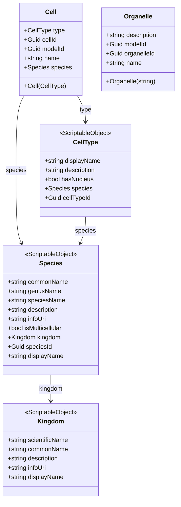

# Classes

<!-- Generated by tools/class-diagram.py. Don't edit by hand. -->

```mermaid
classDiagram
    class Cell {
        +CellType type
        +Guid cellId
        +Guid modelId
        +string name
        +Species species
        +Cell(CellType)
    }
    class CellType {
        <<ScriptableObject>>
        +string displayName
        +string description
        +bool hasNucleus
        +Species species
        +Guid cellTypeId
    }
    class Kingdom {
        <<ScriptableObject>>
        +string scientificName
        +string commonName
        +string description
        +string infoUri
        +string displayName
    }
    class Organelle {
        +string description
        +Guid modelId
        +Guid organelleId
        +string name
        +Organelle(string)
    }
    class Species {
        <<ScriptableObject>>
        +string commonName
        +string genusName
        +string speciesName
        +string description
        +string infoUri
        +bool isMulticellular
        +Kingdom kingdom
        +Guid speciesId
        +string displayName
    }
    Cell --> CellType : type
    Cell --> Species : species
    CellType --> Species : species
    Species --> Kingdom : kingdom
```
