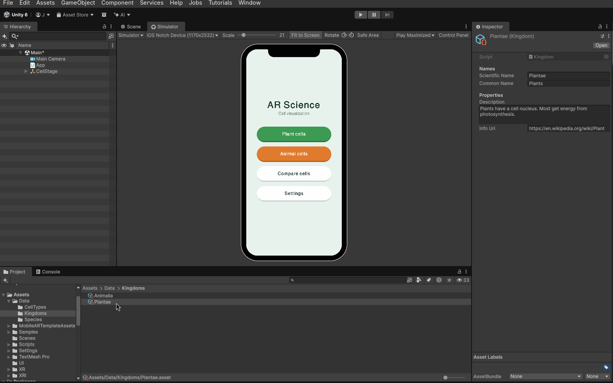

# Editing Assets

## Creating new assets

To create new assets, go to
Assets > Create > AR Science > (Specific asset type).

 Create > AR Science > Kingdom selected"
    src="assets/creating-assets-menus.png">

## Editing existing assets

To edit existing assets, find them under the Project tab > Assets > Data > (Specific ClassNames).
When an asset is selected, the Inspector tab to the right shows its properties.
You can edit the asset in the Inspector.

## Saving assets

You can save an individual file with Ctrl+S, but I find it's most reliable to save the entire Unity project via File > Save Project.

 Save Project selected"
    src="assets/file-save-project.png">
